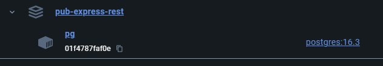
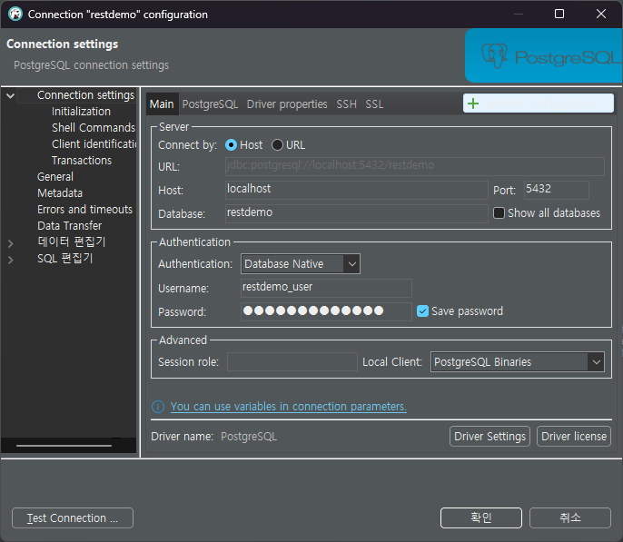
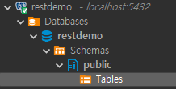

# 01-기본설정

## 목표

```tree
1. 기본설정
   1. 구성
      1. nodejs / express / postgresql / prisma / rest-api / jwt
   2. GITHUB 생성
   3. DOCKER-COMPOSE
      1. 로컬 DB 만들기 : postresql
```

## 로컬 DB 설치하기

postgresql 버전 확인 : 16.3 버전 설치

- [postgresql : versioning](https://www.postgresql.org/support/versioning/)

docker-compose.yml 파일 생성

```yml
version: '3'
services:
  postgres:
    container_name: pub-express-rest-pg
    image: postgres:16.3
    ports:
      - '5432:5432'
    volumes:
      - /tmp/pub-express-rest-pg/data:/var/lib/postgresql/data
    environment:
      POSTGRES_USER: restdemo_user
      POSTGRES_PASSWORD: restdemo_pass
      POSTGRES_DB: restdemo
```

> 볼륭 위치
>
> (in docker desktop - pub-express-rest - pg container)
>
> View details - Files - Bind Mounts 에서 확인할 수 있음
> Mac의 경우 허가된 폴더에서만 mount 가능 ( /tmp 등 추가가능 )

`[그림 1] : docker 동작`



`[그림 2] : dbeaver 연결`



`[그림 3] : dbeaver 스키마`


