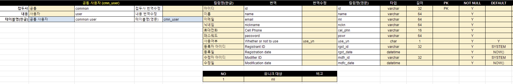

# 02-테이블설계

## 목표

```tree
2. 테이블 설계
   1. 구글 시트를 활용한 테이블 초안 설계
   2. 사용자 정보 추가
```

## 설계

`[그림 1 : 공통 사용자]`



## 참조링크

- [PER-DB_MODELING](https://docs.google.com/spreadsheets/d/1WGvfLKJqnhiqzotDG_pZtTsafIikOlcWGp0XOdLn8Ao/edit?usp=sharing)
- [postgresql : datatype](https://www.postgresql.org/docs/current/datatype.html)
