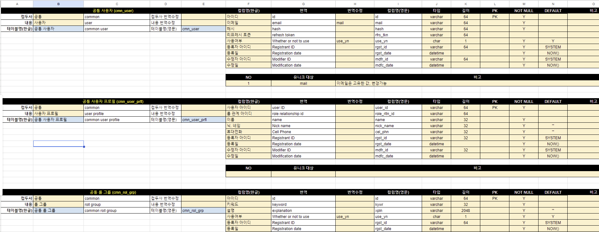
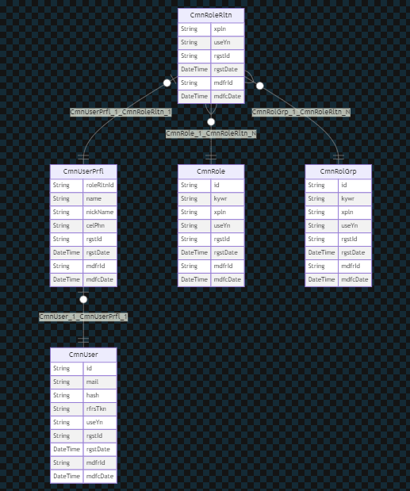

# 02-테이블설계

## 목표

```tree
2. 테이블 설계
   1. 구글 시트를 활용한 테이블 초안 설계
   2. PRISMA를 통한 모델링
```

## 2.1. 구글 시트를 활용한 테이블 초안 설계

`[그림 1 : 테이블 설계]`



[나머지 테이블 설계정보 확인하기 ↗](https://docs.google.com/spreadsheets/d/1WGvfLKJqnhiqzotDG_pZtTsafIikOlcWGp0XOdLn8Ao/edit?usp=sharing)

## 2.2. PRISMA를 통한 모델링

위 테이블 설계를 기반으로 모델링 정보를 작성한다

```prisma
model CmnUser {
  // PK
  id    String  @id @default(uuid())  @db.VarChar(64) // 아이디, UUID = 36자리

  // REF
  cmnUserPrfl CmnUserPrfl? @relation("CmnUser_1_CmnUserPrfl_1")

  // FIELDS
  mail  String  @db.VarChar(64) @unique // 이메일, 유니크
  hash  String  @db.VarChar(64) // 해시, 비밀번호
  rfrsTkn  String?  @db.VarChar(64) @map("rfrs_tkn") // 리프레시 토큰

  // SHARE
  useYn  String @db.Char(1) @default("Y") @map("use_yn")// 사용여부
  rgstId  String @db.VarChar(64) @default("SYSTEM") @map("rgst_id")// 등록자아이디
  rgstDate DateTime  @default(now()) @db.Timestamptz(3) @map("rgst_date") // 등록일
  mdfrId  String @db.VarChar(64) @default("SYSTEM") @map("mdfr_id") // 수정자아이디
  mdfcDate  DateTime  @updatedAt @db.Timestamptz(3) @map("mdfc_date")// 수정일

  @@map("cmn_user") // 공통 사용자
}

model CmnUserPrfl {

  // PK
  userId    String  @id @db.VarChar(64) // 아이디, UUID = 36자리
  cmnUser CmnUser @relation(name:"CmnUser_1_CmnUserPrfl_1", fields: [userId], references: [id]) // 공통 사용자

  // REF
  roleRltnId String? @db.VarChar(64) @map("role_rltn_id")// 롤관계아이디
  cmnRoleRltn CmnRoleRltn? @relation("CmnUserPrfl_1_CmnRoleRltn_1")

  // FIELDS
  name  String  @db.VarChar(32)  // 이름
  nickName  String  @db.VarChar(32)  @map("nick_name") // 닉네임
  celPhn  String  @db.VarChar(32) @map("cel_phn") // 휴대전화

  // SHARE
  // useYn  String @db.Char(1) @default("Y") @map("use_yn")// 사용여부 => 사용자에 정의됨
  rgstId  String @db.VarChar(64) @default("SYSTEM") @map("rgst_id")// 등록자아이디
  rgstDate DateTime  @default(now()) @db.Timestamptz(3) @map("rgst_date") // 등록일
  mdfrId  String @db.VarChar(64) @default("SYSTEM") @map("mdfr_id") // 수정자아이디
  mdfcDate  DateTime  @updatedAt @db.Timestamptz(3) @map("mdfc_date")// 수정일

  @@map("cmn_user_prfl") // 공통 사용자 프로필
}

model CmnRoleRltn{
  // PK
  id    String  @id @default(uuid())  @db.VarChar(64) // 아이디, UUID = 36자리

  // REF
  grpId    String  @db.VarChar(64) @map("grp_id")// 그룹 아이디
  cmnRolGrp CmnRolGrp     @relation(name:"CmnRolGrp_1_CmnRoleRltn_N", fields: [grpId], references: [id])
  rolId    String  @db.VarChar(64) @map("rol_id")// 롤 아이디
  cmnRole CmnRole     @relation(name:"CmnRole_1_CmnRoleRltn_N", fields: [rolId], references: [id])

  cmnUserPrfl CmnUserPrfl @relation("CmnUserPrfl_1_CmnRoleRltn_1", fields: [id], references: [userId]) // 공통 사용자 프로필

  // FIELDS
  xpln  String  @db.VarChar(2048)  @default("") // 설명

  // SHARE
  useYn  String @db.Char(1) @default("Y") @map("use_yn")// 사용여부
  rgstId  String @db.VarChar(64) @default("SYSTEM") @map("rgst_id")// 등록자아이디
  rgstDate DateTime  @default(now()) @db.Timestamptz(3) @map("rgst_date") // 등록일
  mdfrId  String @db.VarChar(64) @default("SYSTEM") @map("mdfr_id") // 수정자아이디
  mdfcDate  DateTime  @updatedAt @db.Timestamptz(3) @map("mdfc_date")// 수정일

  @@unique([grpId, rolId]) // 공통 롤 관계
}

model CmnRole{
  // PK
  id    String  @id @default(uuid())  @db.VarChar(64) // 아이디, UUID = 36자리

  // REF
  cmnRoleRltn CmnRoleRltn[] @relation(name:"CmnRole_1_CmnRoleRltn_N")

  // FIELDS
  kywr  String  @db.VarChar(32)  @unique// 키워드
  xpln  String  @db.VarChar(2048)  @default("") // 설명

  // SHARE
  useYn  String @db.Char(1) @default("Y") @map("use_yn")// 사용여부
  rgstId  String @db.VarChar(64) @default("SYSTEM") @map("rgst_id")// 등록자아이디
  rgstDate DateTime  @default(now()) @db.Timestamptz(3) @map("rgst_date") // 등록일
  mdfrId  String @db.VarChar(64) @default("SYSTEM") @map("mdfr_id") // 수정자아이디
  mdfcDate  DateTime  @updatedAt @db.Timestamptz(3) @map("mdfc_date")// 수정일

  @@map("cmn_role") // 공통 롤
}

model CmnRolGrp{
  // PK
  id    String  @id @default(uuid())  @db.VarChar(64) // 아이디, UUID = 36자리

  // REF
  cmnRoleRltn CmnRoleRltn[] @relation(name:"CmnRolGrp_1_CmnRoleRltn_N")

  // FIELDS
  kywr  String  @db.VarChar(32)  @unique// 키워드
  xpln  String  @db.VarChar(2048)  @default("") // 설명

  // SHARE
  useYn  String @db.Char(1) @default("Y") @map("use_yn")// 사용여부
  rgstId  String @db.VarChar(64) @default("SYSTEM") @map("rgst_id")// 등록자아이디
  rgstDate DateTime  @default(now()) @db.Timestamptz(3) @map("rgst_date") // 등록일
  mdfrId  String @db.VarChar(64) @default("SYSTEM") @map("mdfr_id") // 수정자아이디
  mdfcDate  DateTime  @updatedAt @db.Timestamptz(3) @map("mdfc_date")// 수정일

  @@map("cmn_rol_grp") // 공통 롤 그룹
}

```

`[그림 2 : 테이블 ERD]`

vscode 에서 `prisma generate UML` 플러그인을 설치하면 ERD를 생성할 수 있다



## 참조링크

- [PER-DB_MODELING](https://docs.google.com/spreadsheets/d/1WGvfLKJqnhiqzotDG_pZtTsafIikOlcWGp0XOdLn8Ao/edit?usp=sharing)
- [postgresql : datatype](https://www.postgresql.org/docs/current/datatype.html)
